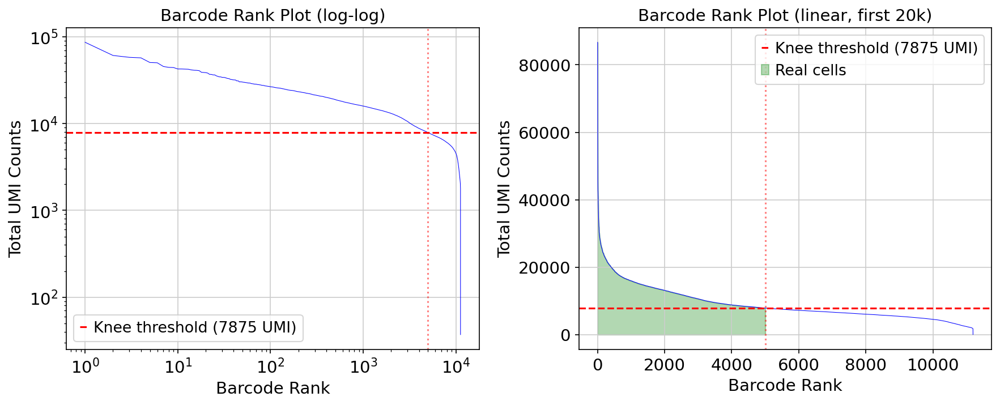
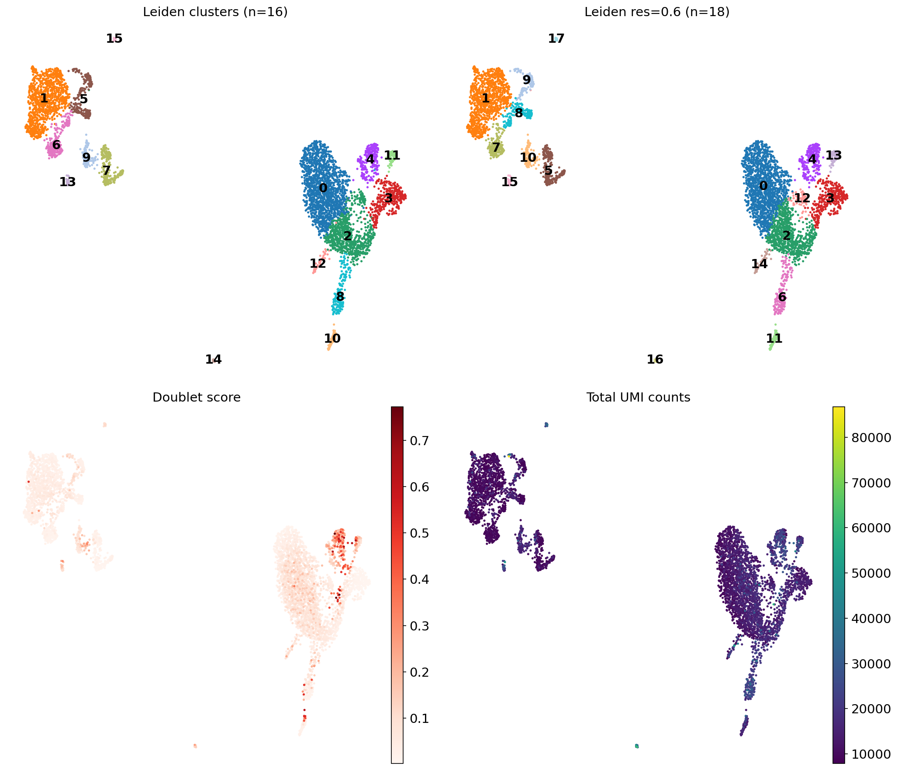
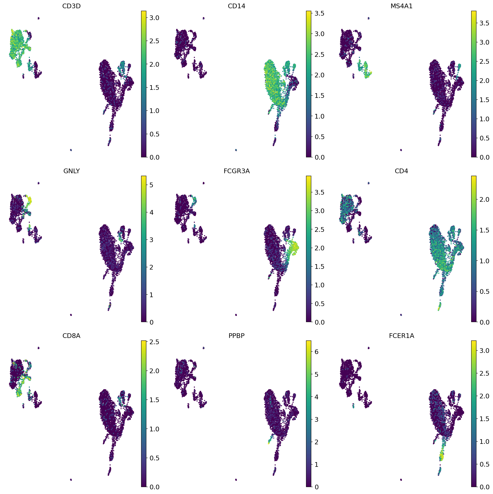
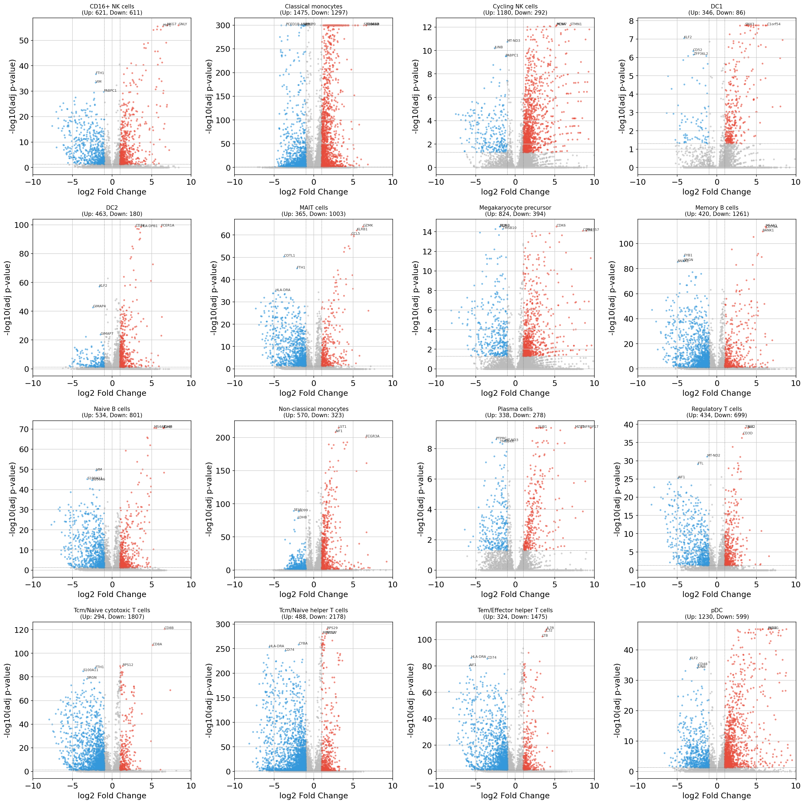
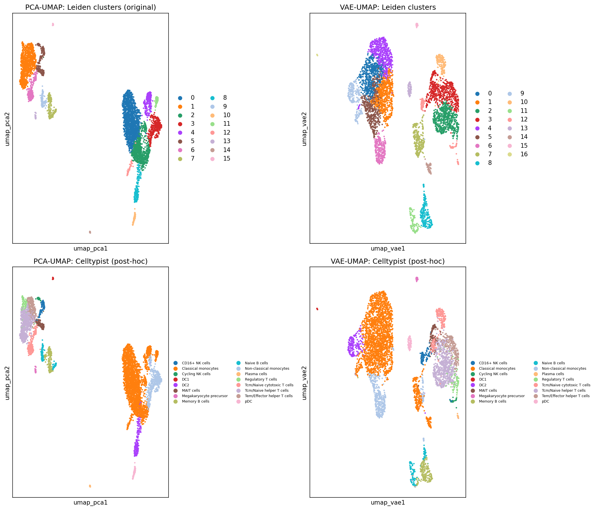

# scRNA-seq Snakemake Pipeline

A reproducible single-cell RNA-seq analysis pipeline using alevin-fry for quantification and Scanpy for QC and downstream analysis.

## Overview

This pipeline processes 10x Chromium scRNA-seq data through:

1. **Quantification** - salmon alevin + alevin-fry (pseudoalignment, UMI deduplication, cell calling)
2. **QC** - Scanpy quality control with filtering and visualization
3. **Downstream analysis** - Clustering, cell type annotation, differential expression, marker genes, VAE embedding

## Quick Start
Note: you must have conda installed (recommend miniconda), instructions for which will vary based on your OS
```bash
# 1. Clone the repository
git clone https://github.com/slang314/scrnaseq_snakemake.git
cd scrnaseq_snakemake

# 2. Create conda environments
conda env create -f envs/af.yaml
conda env create -f envs/scanpy.yaml

# 3. Build reference index (requires af environment)
conda activate af
./scripts/setup_reference.sh

# 4. Download demo data
./scripts/setup_demo_data.sh

# 5. Run the pipeline
conda activate scanpy
snakemake --cores 16 --use-conda
```

## Requirements

- [Miniconda](https://docs.conda.io/en/latest/miniconda.html)
- ~50 GB disk space for reference + demo data
- 16+ GB RAM recommended

## Project Structure

```
scrnaseq_snakemake/
├── Snakefile                 # Main pipeline definition
├── config/
│   ├── config.yaml           # Pipeline parameters
│   └── samples.tsv           # Sample sheet (FASTQ paths)
├── envs/
│   ├── af.yaml               # salmon/alevin-fry environment
│   └── scanpy.yaml           # Python analysis environment
├── scripts/
│   ├── setup_reference.sh    # Download & build reference
│   ├── setup_demo_data.sh    # Download demo FASTQ data
│   ├── af_to_anndata.py      # Convert alevin-fry → AnnData
│   ├── scanpy_qc.py          # QC filtering
│   ├── downstream_analysis_v3.py  # Clustering & annotation
│   └── vae_embedding.py      # VAE latent space analysis
├── resources/
│   └── reference/af_ref/     # Reference files (built by setup script)
├── data/                     # FASTQ files (user-provided)
└── results/                  # Pipeline outputs
```

## Setup

### 1. Reference Files

The pipeline requires a salmon index for the human transcriptome. Run the setup script:

```bash
conda activate af
./scripts/setup_reference.sh
```

This downloads from GENCODE and builds:
- `resources/reference/af_ref/index/` - Salmon index (~900 MB)
- `resources/reference/af_ref/t2g.tsv` - Transcript-to-gene mapping
- `resources/reference/af_ref/3M-february-2018.txt` - 10x barcode whitelist

### 2. Demo Data

Download 10x Genomics PBMC datasets for testing:

```bash
./scripts/setup_demo_data.sh
```

Options:
- **pbmc_1k_v3** - 1,000 cells (~5 GB) - quick testing
- **pbmc_10k_v3** - 10,000 cells (~48 GB) - full demo

### 3. Sample Sheet

Edit `config/samples.tsv` to point to your FASTQ files:

```
sample          fq1                                     fq2
pbmc_10k_v3     /path/to/sample_L001_R1_001.fastq.gz,/path/to/sample_L002_R1_001.fastq.gz    /path/to/sample_L001_R2_001.fastq.gz,/path/to/sample_L002_R2_001.fastq.gz
```

- Multiple lanes: comma-separate paths (no spaces)
- R1 = barcode + UMI reads
- R2 = cDNA reads

## Running the Pipeline

### Main Pipeline (Snakemake)

```bash
# Activate scanpy environment (contains snakemake)
conda activate scanpy

# Dry run - see what will be executed
snakemake --dry-run --cores 16

# Run pipeline
snakemake --cores 16 --use-conda

# Force re-run all steps
snakemake --cores 16 --use-conda --forceall
```

### Downstream Analysis (Manual)

After the main pipeline completes:

```bash
conda activate scanpy

# Clustering, cell typing, marker genes, differential gene expression (pseudobulked by cell type)
python scripts/downstream_analysis_v3.py

# VAE embedding (optional)
python scripts/vae_embedding.py
```

## Outputs

### Main Pipeline

```
results/
├── af/{sample}/quant/           # alevin-fry count matrices
├── anndata/
│   ├── raw/{sample}.h5ad        # Raw counts
│   ├── qc/{sample}.h5ad         # QC-filtered
│   └── merged_qc.h5ad           # Merged samples
└── qc/{sample}/
    ├── qc_metrics.tsv           # QC statistics
    ├── {sample}_qc_violin.png   # QC violin plots
    └── {sample}_qc_scatter.png  # QC scatter plots
```

### Downstream Analysis

```
results/downstream_v3/
├── figures/
│   ├── barcode_rank_plot.png    # Knee plot for cell calling
│   ├── umap_overview.png        # UMAP with clusters
│   ├── umap_celltypist.png      # Cell type annotations
│   ├── umap_pbmc_markers.png    # Marker gene expression
│   ├── doublet_scores.png       # Scrublet doublet detection
│   ├── volcano_plots_all_celltypes.png  # DE volcano plots (overview)
│   ├── volcano_individual/      # Individual volcano plots per cell type
│   ├── vae_training_loss.png    # VAE training curve
│   ├── umap_pca_vs_vae.png      # PCA vs VAE comparison
│   └── umap_vae_markers.png     # Markers on VAE UMAP
├── marker_genes_all_clusters.tsv    # Marker genes per Leiden cluster
├── de_genes_by_celltype.tsv         # DE genes per cell type (CellTypist)
├── pbmc_10k_annotated_v3.h5ad       # Full annotated dataset
└── pbmc_10k_annotated_v3_clean.h5ad # Doublets removed
```

### Example Output (PBMC 10k Demo)

Running the pipeline on the 10x PBMC 10k demo dataset produces:

**Analysis Summary** (`analysis_summary.tsv`):
```
cells_after_knee_filter     5001
genes                       34086
hvgs                        2888
n_clusters_res0.4           16
predicted_doublets          131
cells_after_doublet_removal 4870
```

**Marker Genes by Cluster** (`marker_genes_all_clusters.tsv`):
```
group  names            scores   logfoldchanges  pvals_adj  gene_symbol
0      ENSG00000163220  51.83    5.30            0.0        S100A9
0      ENSG00000143546  51.56    5.28            0.0        S100A8
0      ENSG00000163221  50.59    4.45            0.0        S100A12
```

**DE Genes by Cell Type** (`de_genes_by_celltype.tsv`):
```
group           names            scores  logfoldchanges  pvals_adj   gene_symbol
CD16+ NK cells  ENSG00000105374  16.48   6.95            1.04e-56    NKG7
CD16+ NK cells  ENSG00000115523  16.47   8.37            1.04e-56    GNLY
CD16+ NK cells  ENSG00000180644  16.38   6.42            2.86e-56    PRF1
```

**Example Figures**:

*Barcode Rank Plot* - Knee plot for cell calling:



*UMAP Overview* - Leiden clusters and sample distribution:



*CellTypist Annotations* - Automated cell type labels:


*Marker Gene Expression* - Canonical PBMC markers on UMAP:



*Differential Expression* - Volcano plots for all cell types:



*PCA vs VAE Embedding* - Comparison of dimensionality reduction methods:



**Cell Types Identified** (CellTypist on PBMC):
- CD16+ NK cells, Cycling NK cells
- Classical monocytes, Non-classical monocytes
- Naive B cells, Memory B cells, Plasma cells
- Tcm/Naive cytotoxic T cells, Tcm/Naive helper T cells
- Tem/Effector helper T cells, Regulatory T cells, MAIT cells
- DC1, DC2, pDC
- Megakaryocyte precursor

## Configuration

Edit `config/config.yaml`:

```yaml
reference:
  af_dir: "resources/reference/af_ref"

alevin_fry:
  threads: 16
  mem_gb: 48
  chemistry: "3prime-v3"

scanpy_qc:
  species: "human"
  mito_prefix: "MT-"
  min_genes: 200
  min_cells_per_gene: 3
  max_pct_mt: 20
```

## Cell Type Annotation

Cell type annotations are generated automatically using [CellTypist](https://www.celltypist.org/), a tool for automated cell type classification based on logistic regression classifiers.

**Default model:** `Immune_All_Low.pkl` (immune cells from multiple tissues)

This model is appropriate for PBMC and other immune-enriched samples. **If you are analyzing non-immune cells** (e.g., neurons, epithelial cells, cancer cells), you must use a different CellTypist model.

### Changing the CellTypist Model

1. Browse available models at https://www.celltypist.org/models
2. Edit `scripts/downstream_analysis_v3.py` lines 516-517:
   ```python
   # Change 'Immune_All_Low.pkl' to your model
   models.download_models(force_update=False, model='Your_Model.pkl')
   model = models.Model.load(model='Your_Model.pkl')
   ```

### Available Models (examples)

| Model | Use Case |
|-------|----------|
| `Immune_All_Low.pkl` | Immune cells (default) |
| `Immune_All_High.pkl` | Immune cells (coarser resolution) |
| `Human_Lung_Atlas.pkl` | Lung tissue |
| `Cells_Intestinal_Tract.pkl` | Gut epithelium |
| `Developing_Human_Brain.pkl` | Brain/neurons |
| `Pan_Fetal_Human.pkl` | Fetal tissues |

See the [CellTypist models page](https://www.celltypist.org/models) for the full list.

## Conda Environments

| Environment | Purpose | Create |
|-------------|---------|--------|
| `af` | salmon, alevin-fry | `conda env create -f envs/af.yaml` |
| `scanpy` | Snakemake, Scanpy, analysis | `conda env create -f envs/scanpy.yaml` |

Snakemake automatically uses the correct environment for each rule when run with `--use-conda`.

## Adding Your Own Data

1. Place FASTQ files in `data/fastq/your_sample/`
2. Add entry to `config/samples.tsv`
3. Run: `conda activate scanpy && snakemake --cores 16 --use-conda`

## License

MIT

## Citation

If you use this pipeline, please cite:
- [salmon](https://doi.org/10.1038/nmeth.4197)
- [alevin-fry](https://doi.org/10.1038/s41592-022-01408-3)
- [Scanpy](https://doi.org/10.1186/s13059-017-1382-0)
